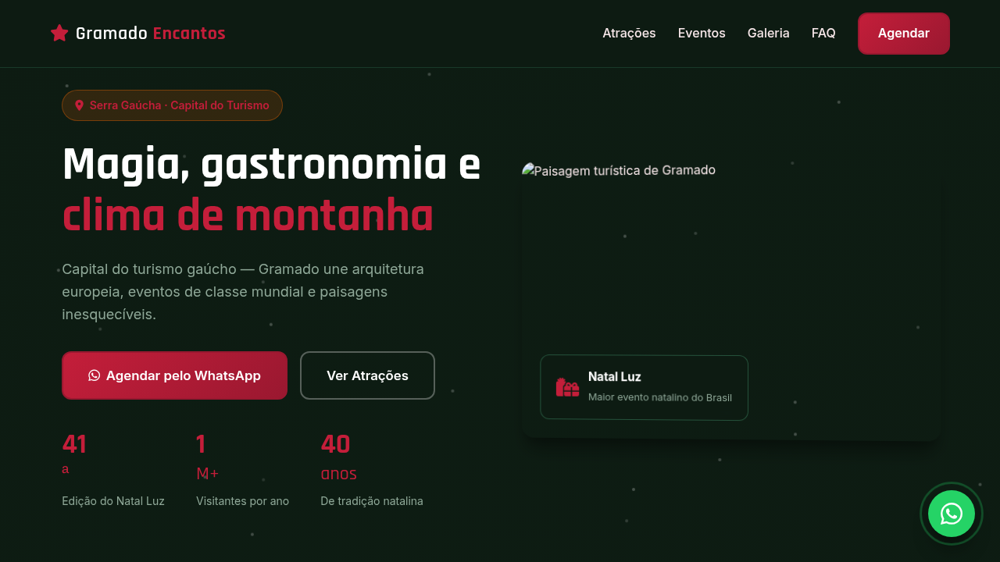
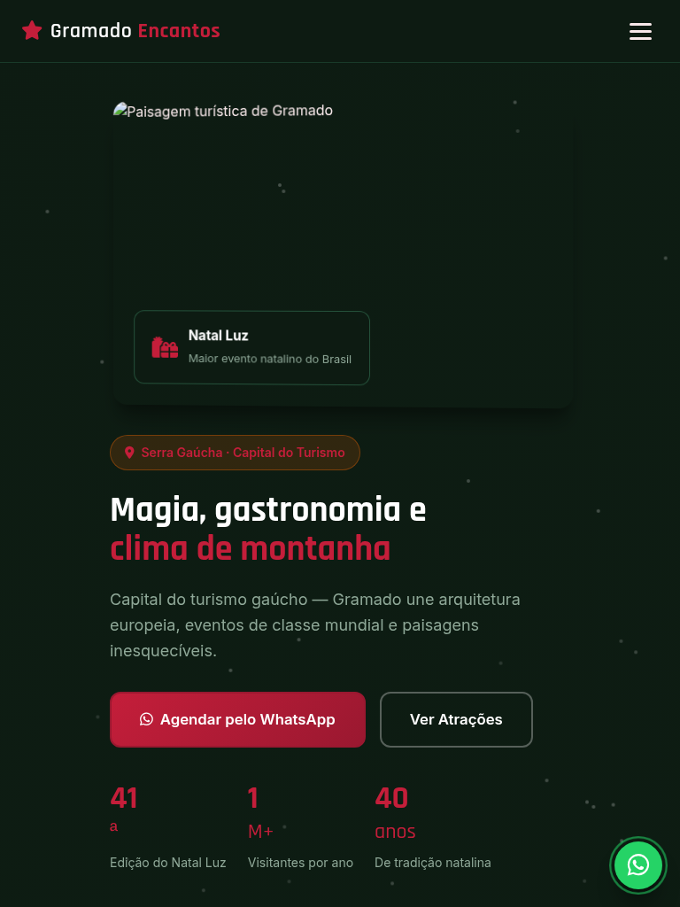
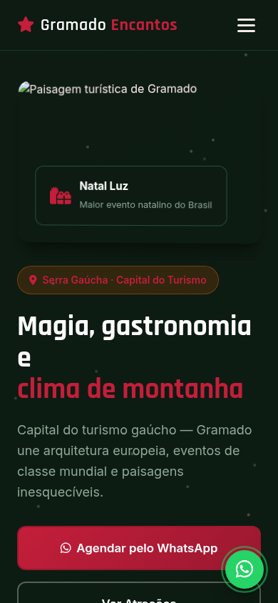

# Gramado — Landing Page de Turismo

Landing page de alta conversão para turismo em **Gramado** (Serra Gaúcha · Capital do Turismo), com atrações autênticas, eventos locais, galeria visual e agendamento estruturado via WhatsApp.

[](https://tofariasti.github.io/turismo-gramado/)

## Demo

**Moldura (preview):** [https://tofariasti.github.io/turismo-gramado/](https://tofariasti.github.io/turismo-gramado/)

**Tela cheia:** [https://tofariasti.github.io/turismo-gramado/site/](https://tofariasti.github.io/turismo-gramado/site/)

## Screenshots

### Desktop (1280px)


### Tablet (768px)


### Mobile (390px)


## Funcionalidades

- Design responsivo mobile-first com identidade visual regional
- Integração WhatsApp com formulário para agendar visita (nome, data, pessoas, roteiro)
- Animações AOS, partículas no hero, contadores e hover nos cards
- Seções: Hero, Como funciona, Atrações, Eventos, Galeria, FAQ e Contato
- Botão flutuante WhatsApp com pulse
- Acessibilidade: skip link, ARIA, contraste, foco visível, alt text
- Respeita `prefers-reduced-motion`
- Moldura iframe com preview desktop/tablet/mobile

## Pontos turísticos destacados

- **Lago Negro** — Lago artificial cercado de hortênsias e pedalinhos — cartão-postal de Gramado.
- **Mini Mundo** — Parque com 140 miniaturas de monumentos mundiais em escala 1:24.
- **Rua Coberta** — Galeria a céu aberto com lojas, cafés e apresentações culturais gratuitas.
- **Snowland** — Parque de neve indoor com pista de ski, trenó e diversão para toda família.
- **Parque Knorr** — Trilhas ecológicas, araucárias centenárias e contato direto com a mata.
- **Palácio dos Festivais** — Centro de convenções e palco dos grandes espetáculos do Natal Luz.

## Eventos

- **Natal Luz de Gramado** (Out–Jan) — Grande Desfile, Nativitaten, Vila de Natal e Caminho de Luzes.
- **Festival de Cinema** (Ago) — Gramado recebe o principal festival de cinema brasileiro.
- **Festuris** (Mai) — Feira internacional de turismo — referência no setor.
- **Acendimento das Luzes** (Ano todo) — Cerimônia gratuita diária na Rua Coberta durante o Natal Luz.

## Tecnologias

- HTML5 semântico · CSS3 · JavaScript vanilla
- AOS 2.3.4 · Font Awesome 6.4 · Google Fonts (Rajdhani + Inter)

## Screenshots (geração)

```bash
python3 -m http.server 8765
npm install
npm run screenshots
```

## Repositório

https://github.com/tofariasti/turismo-gramado

## Autor

**Tiago O. de Farias** — [Farias Digital](https://fariasdigital.com.br/)

---

<p align="center">
  <a href="https://tofariasti.github.io/turismo-gramado/">🌐 Demo Online</a> ·
  <a href="https://fariasdigital.com.br/">🏢 Site Comercial</a>
</p>
